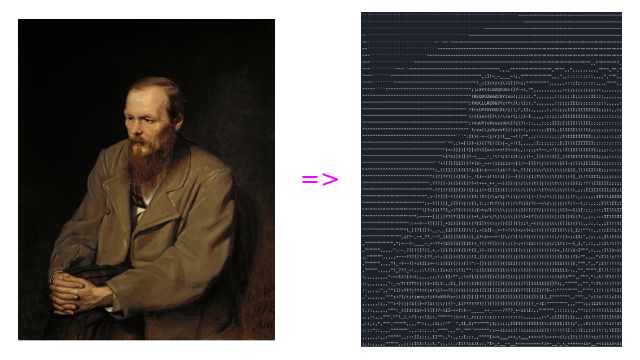

<h1 align="center"> Image to ASCII  🖼️ ➡️ (̿▀̿ ̿Ĺ̯̿̿▀̿ ̿)̄</h1>

<h3 style="text-align: center">Changing brightness formula might help for different images.</h3>

<h2>How to Run</h2>

Change <code>Image.open("src/image.jpg")</code> to your liking.

Then run with your virtual environment interpreter (virtualenv, pipenv etc.).

<h2>Requirements</h2>
<ul>
<li>Pillow
<li>Python 3.x
</ul>